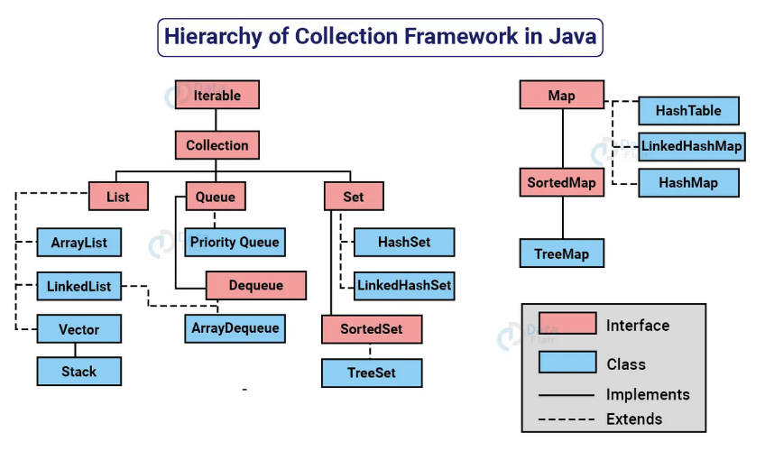

# Collections Framework API
* É um coleção/ estrutura de dados que serve para agrupar muitos elementos em uma única unidade, estes elementos precisão ser Objetos.
* Podem ser homogêneas e heterogêneas. Normalmente, são de um tipo específico
* O núcle principal das coleções é formado por interfaces, que permitem manipular a coleção independente do nível de detalhe que elas representam.
* Quatro tipos de coleções: `List`, `set`, `Queue` e `Map`
***


***
* Todas as classes e interfaces estão dentro do package `java.util`. O próprio java providencia os collections.
## Genericst Type
* É um tipo genérico que uma classe genérioca ou uma interface que é parametrizada em relação a tipos.
* A classe Box a seguir será modificada para demonstrar o conceito.
`````java
public class Box{
    private Obejct object;
    public void set(Object object){ this.object = object;}
    public Object get() { return object;}
}
`````
* O símbolo `<>` é chamado de diamond ou diamond operator foi um recurso introduzido no Java 7 e é usado no contexto de tipos genéricos para inferir automaticament o tipo com base no contexto.
* Para atualizar a classe Box para usar generics, você cria uma declaração de tipo genérico alterando o código para "public class Box" para "public class Box <T<T>>"
`````java
public class Box <T>{
    private T;
    public void set(T t){ this.t = t;}
    public T get() { return t;}
}
`````
* Todas as ocorrencências são substituidas por T
* Uma variável pode ser de qualquer tipo não primitivo, qualquer tipo de classe, tipo de interface, de array ou variáveis de outros tipos.
* Os nomes mais comuns:
    *  E - elemento
    *  K - Chave
    *  N - número
    * existem outras letras

## Comparable X Comparator
São interfaces que servem para ordenar e comparar os elementos dentro de uma collection. 
### Comparable
* `Comparable` fornece uma única sequência de ordenação. Em outras plavras, podemos ordenar a coleção com base em um único elemento, como id, nome e preço.
* `Comparable` afeta a classe original, ou seja a classe atual é modificada.
* `Comparable` fornece o método `compareTo()` para ordenar os elementos. A partir de qual atributo será a ordem natural da classe. 
* ``Comparable`` está presente no `java.lang`
* Podemos ordenar os elementos da lista do tipo ``Comparable`` usando o método `Collections.sort(List)`
### Comparator
* O ``Comparator`` fornece o método `compare()` para ordenar elementos. 
* ``Comparator`` fornece múltiplas sequências de ordenação. Pode-se ordenar a coleção com base em múltiplos elementos como id, nome, preço, etc.
* ``Comparator`` não afeta a classe original. A classe atual não é modificada.
* ``Comparator`` presente no pacote ``java.util`
* Possível ordenar os elementos da lista do tipo ``Comparator`` usando o método ``Collections.sort(List, Comparator)``
### Collections
* é um classe utilitária para operações comuns em coleções.
* Fornece métodos para ordenação, busca, manipulação e sincronização de coleções.
* Método ``sort()`` é usado para ordenar uma lista em ordem ascendente. Quando usando com o ``Colections.reverseOrder()`` permite ordenar em ordem descendente.
## List
* É uma interface, com uma coleção ordenada que permite a inclusão de elementos duplicados. 
* É um dos tipos de coleção mais utilizados em Java, e as classes de implementação comuns são ``ArrayList`` e ``LinkedList``.
* Se assemelha a uma matriz com comprimento dinâmico, permitindo adicionar ou remover elementos. 
* A interface `List` fornece métodos úteis para adicionar elementos em posições específicas, remover ou substitur elementos com base no índice e obter sublistas usando índices.
* A classe ``Collections` fornece algoritmos úteis para manipulação de `List`, como ordenação (sort), embaralhamento (shuffle), reverse e busca binária (binarySearch)